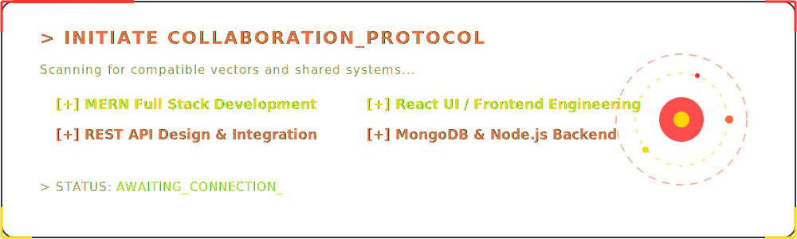

<div align="center">
  
</div>

<div align="center">
  <a href="https://git.io/typing-svg"></a>
</div>

<div align="center">
  
</div>

<br/>

<div align="center">
  <a href="https://linkedin.com/in/tanmayrongre"></a>&nbsp;
  <a href="mailto:tanmayrongre2008@gmail.com"></a>&nbsp;
  <a href="https://tanmayrongre.github.io/Portfolio-React"></a>
</div>

<br/>

<div align="center">
  
</div>

## 「 About Me 」

```javascript
const tanmay = {
    alias:    "tanmayrongre",
    role:     "MERN Full Stack Developer",
    degree:   "BE CSE Graduate",
    focus:    ["MongoDB", "Express.js", "React", "Node.js"],
    building: "Full-Stack Web Apps with MERN Stack",
    learning: ["REST APIs", "JWT Auth", "Cloud Deployment"],
    funFact:  "I turn ideas into full-stack apps — one MERN project at a time 🔥"
};
```

- 🔥 Currently building **MERN Full Stack Web Applications**
- 🌐 Crafting **REST APIs with Express.js & Node.js**
- ⚛️ Building **dynamic UIs with React**
- ⚡ Ask me about **MongoDB, Express, React, Node.js**

<br clear="both"/>

<div align="center">
  
</div>

## 「 Technologies 」

<table border="0" cellspacing="12" cellpadding="0" align="center">
<tr>

<td width="420" valign="top" align="center">

<h3>⚡ Languages</h3>
<br>

<table align="center" cellspacing="0" cellpadding="10">
  <tr>
    <td align="center"><br/><sub><b>Python</b></sub></td>
    <td align="center"><br/><sub><b>JavaScript</b></sub></td>
    <td align="center"><br/><sub><b>Java</b></sub></td>
    <td align="center"><br/><sub><b>C++</b></sub></td>
  </tr>
  <tr>
    <td align="center"><br/><sub><b>HTML5</b></sub></td>
    <td align="center"><br/><sub><b>CSS3</b></sub></td>
    <td align="center"><br/><sub><b>SQL</b></sub></td>
    <td align="center"><br/><sub><b>Kotlin</b></sub></td>
  </tr>
</table>

</td>

<td width="420" valign="top" align="center">

<h3>🔥 MERN Stack &amp; Tools</h3>
<br>

<table align="center" cellspacing="0" cellpadding="10">
  <tr>
    <td align="center"><br/><sub><b>MongoDB</b></sub></td>
    <td align="center"><br/><sub><b>Express.js</b></sub></td>
    <td align="center"><br/><sub><b>React</b></sub></td>
    <td align="center"><br/><sub><b>Node.js</b></sub></td>
  </tr>
  <tr>
    <td align="center"><br/><sub><b>Git</b></sub></td>
    <td align="center"><br/><sub><b>GitHub</b></sub></td>
    <td align="center"><br/><sub><b>Postman</b></sub></td>
    <td align="center"><br/><sub><b>VS Code</b></sub></td>
  </tr>
</table>

</td>

</tr>
</table>

<div align="center">
  
</div>

## 「 Portfolio Showcase 」

<table width="100%" border="0" cellspacing="12" cellpadding="0">
<tr>
  <td width="33.3%" valign="top" align="center"><a href="https://github.com/tanmayrongre?tab=repositories"></a></td>
  <td width="33.3%" valign="top" align="center"><a href="https://tanmayrongre.github.io/My_Awards/"></a></td>
  <td width="33.3%" valign="top" align="center"><a href="https://tanmayrongre.github.io/My_Certifications/"></a></td>
</tr>
</table>

<div align="center">
  
</div>

## 「 GitHub Stats 」

<div align="center">
  
</div>

<br/>

<div align="center">
  
</div>

<div align="center">
  
</div>

<div align="center">
  <a href="./docs/COLLAB.md"></a>
</div>

<br/>

<div align="center">
  <a href="https://tanmayrongre.github.io">&nbsp;</a>&nbsp;&nbsp;
  <a href="mailto:tanmayrongre@gmail.com"></a>&nbsp;&nbsp;
  <a href="https://linkedin.com/in/tanmayrongre"></a>
</div>

<div align="center">
  
</div>
